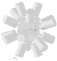

# G4TIP

This repo is maintained by Jonathan Williams, see the full list of contributors [below](#contributors).

## Description

Unified simulation code for [TIP](https://fiveyearplan.triumf.ca/tip/) and [TIGRESS](https://fiveyearplan.triumf.ca/teams-tools/tigress-triumf-isac-gamma-ray-suppressed-spectrometer/) using the GEANT4 framework.

At present, fusion-evaporation and Coulomb excitation reaction processes are available, and the TIP CsI wall/ball and GRIFFIN/TIGRESS array geometries are implemented.  The user can arbitrarily define a multi-layer reaction target using macro commands, or use the predefined TIP plunger (for RDM) or DSAM targets.

For fusion-evaporation, arbitrary step-wise decay of the residual nucleus (gamma ray cascade) is availaible.  Coulomb excitation is single-step (E2).

## Installation

This code has been tested on Ubuntu 14.04/16.04, CentOS 7, and Arch Linux (as of September 2020).  Follow the instructions below to set up the required dependencies.

### ROOT

ROOT trees are used to store simulated data.  The code is tested with v6.x, but earlier versions may work.  You may already have this set up (in that case just make sure that the environment variables are correctly defined). If not, ROOT should be built from source:

[ROOT source code](https://root.cern.ch/downloading-root)

[ROOT build and install guide](https://root.cern.ch/building-root)

Set up environment variables for ROOT by adding the following lines to your `~/.bashrc` (substituting the appropriate paths):

```
#ROOT configuration
export ROOTSYS=/path/to/root
export ROOTINC=/path/to/root/include
export ROOTLIB=/path/to/root/lib
export LD_LIBRARY_PATH=$LD_LIBRARY_PATH:$ROOTLIB
export PATH=$PATH:$ROOTSYS/bin
```

### GEANT4

The code is tested with GEANT4 v10.6.  It may still work with older versions.

[GEANT4 source code](https://geant4.web.cern.ch/support/download)

[GEANT4 build and install guide](https://geant4-userdoc.web.cern.ch/geant4-userdoc/UsersGuides/InstallationGuide/html/installguide.html)

GEANT4 should be built with its data files and the Qt visualization drivers, using the `-DGEANT4_INSTALL_DATA=ON` and `-DGEANT4_USE_QT` switches specified in its install guide.  Set up environment variables for GEANT4 by adding the following lines to your `~/.bashrc` (substituting the appropriate paths):

```
#for GEANT4
export G4INSTALL=/path/to/geant4_install_directory
source $G4INSTALL/bin/geant4.sh
#substitute GEANT4_VERSION in the next line with the appropriate directory
source $G4INSTALL/share/GEANT4_VERSION/geant4make/geant4make.sh
```

### Redacted files

This program requires secret files describing the GRIFFIN geometry (`DetectionSystemGriffinSuppressed.cc` and `DetectorConstructionSuppressed.cc`).  To get them, ask a collaborator or your boss.  After obtaining these files, copy them to the `src` directory.

### Build the simulation code

The program is then compiled from source using the following commands (substituting the appropriate directory):

```
cmake -DGeant4_DIR=/path/to/geant4_install_directory/lib/GEANT4_VERSION .
make -j
```

The `cmake` step needs to be re-done if you move the code to a different directory.

## Using the program

The program `G4TIP` is run from the command line and takes a batch file as its only argument.  The batch file contains a list of commands which are executed in order by the program.  The `macros` directory contains some examples of working batch files, it may be easier to copy one of these and modify it.  Tables explaining most (but not all) of the available commands follow:

### Reaction mechanism and physics parameters

One of the reaction mechanisms (`/Physics/FusionEvaporation` or `/Physics/Coulex`) must be specified.

|**Command**|**Effect**|
|:---:|:---:|
| /Physics/FusionEvaporation | Use the fusion-evaporation reaction mechanism. The reaction should be further configured using the reaction parameters listed [below](#fusevappar). |
| /Physics/Coulex | Use the Coulomb excitation reaction mechanism. The reaction should be further configured using the reaction parameters listed [below](#coulexpar) |
| /Physics/IgnoreNeutrons | Ignore neutron interactions in the simulation.  Useful if there are no neutrons produced in the reaction and you want to speed up the simulation. |
| /Physics/StoppingTable PATH | Use custom stopping power tables from the directory specified by PATH.  The format of the tables is expected to be the same as those provided in the default GEANT4 dataset.  If not set, GEANT4 will use its default ICRU73-based stopping power tables. |

### Detectors and geometry

|**Command**|**Effect**|
|:---:|:---:|
| /Construction/UseCsIWall | Use the CsI wall ancillary array for charged particle detection.  This is the default option if no other ancillary array is specified. |
| /Construction/UseCsIBall | Use the CsI ball ancillary array for charged particle detection. |
| /Construction/NoAncillaryArray | Do not use an ancillary array for charged particle detection. |
| /Construction/UseTarget | Use the user-definable reaction target (this option is used by default, unless `/Construction/UseDSAMTarget` or `/Construction/UsePlunger` are set).  The target geometry is configured using parameters listed [below](#tarpar).|
| /Construction/UseDSAMTarget | Use the DSAM reaction target.  The target geometry is configured using parameters listed [below](#dsampar). |
| /Construction/UsePlunger | Use the TIP plunger as the reaction target.  The plunger geometry is configured using parameters listed [below](#plungerpar). |
| /Construction/ShiftChamber NUMBER mm | Set the position of the TIP chamber along the z (beam) axis (0 mm is centred with respect to the TIGRESS array). |
| /Construction/ShiftPlunger NUMBER mm | Set the position of the plunger along the z (beam) axis with respect to the TIP chamber (0 mm is centred with respect to the chamber). |
| /Griffin/UseTIGRESSPositions true/false | Use TIGRESS array positions (if false, GRIFFIN positions will be used instead).  True by default. |
| /Griffin/UseTIGRESSSegments true/false | Use TIGRESS segments in the simulation.  True by default.  This option doesn't modify the detector geometry, it just saves extra position tracking information for the germanium array. |
| /Griffin/FrontSegmentTrackingSpherical true/false | When using TIGRESS segment tracking, track the front segments in spherical coordinates (to better follow the electric field expected in the detector), and the rear segments in cylindrical coordinates.  True by default, if set to false all segments will be tracked with cylindrical coordinates. |

#### Target parameters<a name="tarpar"></a>

These commands configure the default target type, which is always used unless `/Construction/UseDSAMTarget` or `/Construction/UsePlunger` are set.

|**Command**|**Effect**|
|:---:|:---:|
| /Target/LayerX/Thickness NUMBER um | The thickness of the layer (where X is the layer number, eg. `Layer1` for the first layer, `Layer2` for the second layer).  Alternatively this can be specified in mg/cm<sup>2</sup> using `/Target/LayerX/ThicknessMgCm2`. |
| /Target/LayerX/Position NUMBER um | The position of the layer (where X is the layer number, eg. `Layer1` for the first layer, `Layer2` for the second layer). |
| /Target/LayerX/A NUMBER | The mass number of the layer. |
| /Target/LayerX/Material STRING<sup>1</sup> | The layer material. |
| /Target/ReactionLayer NUMBER | The layer at which the reaction (Coulex, fusion-evaporation, etc.) takes place (eg. if NUMBER is 1, then the reaction takes place in `Layer1`). |

<sup>1</sup>GEANT4 material strings are used, typically formatted as `G4_ELEMENT` (eg. copper would be `G4_Cu`).  Vacuum is also a material: `G4_Galactic`.

#### DSAM target parameters<a name="dsampar"></a>

These commands will only be used if `/Construction/UseDSAMTarget` is set.

|**Command**|**Effect**|
|:---:|:---:|
| /DSAMTarget/Target/A NUMBER | The mass number of the reaction target (number of nucleons). |
| /DSAMTarget/Target/Z NUMBER | The proton number of the reaction target. |
| /DSAMTarget/Target/Material STRING<sup>1</sup> | The reaction target material. |
| /DSAMTarget/Target/Thickness NUMBER um | The reaction target thickness (alternatively this can be specified in mg/cm<sup>2</sup> using `/DSAMTarget/Target/ThicknessMgCm2`). |
| /DSAMTarget/Backing/A NUMBER | The mass number of the target backing (number of nucleons). |
| /DSAMTarget/Backing/Z NUMBER | The proton number of the target backing. |
| /DSAMTarget/Backing/Material STRING<sup>1</sup> | The target backing material. |
| /DSAMTarget/Backing/Thickness NUMBER um | The target backing thickness (alternatively this can be specified in mg/cm<sup>2</sup> using `/DSAMTarget/Backing/ThicknessMgCm2`). |

<sup>1</sup>GEANT4 material strings are used, typically formatted as `G4_ELEMENT` (eg. copper would be `G4_Cu`).  Vacuum is also a material: `G4_Galactic`.


#### Plunger parameters<a name="plungerpar"></a>

These commands will only be used if `/Construction/UsePlunger` is set.

|**Command**|**Effect**|
|:---:|:---:|
| /Plunger/Backing/Material STRING<sup>1</sup> | The plunger target backing material. |
| /Plunger/Backing/Thickness NUMBER um | The plunger target backing thickness. |
| /Plunger/Target/Material STRING<sup>1</sup> | The plunger reaction target material. |
| /Plunger/Target/Thickness NUMBER um | The plunger reaction target thickness (alternatively this can be specified in mg/cm<sup>2</sup> using `/Plunger/Target/ThicknessMgCm2`). |
| /Plunger/Stopper/Material STRING<sup>1</sup> | The plunger stopper/degrader material. |
| /Plunger/Stopper/Thickness NUMBER um | The plunger reaction stopper/degrader thickness. |
| /Plunger/Separation NUMBER um | The separation between the plunger target and stopper/degrader. |

<sup>1</sup>GEANT4 material strings are used, typically formatted as `G4_ELEMENT` (eg. copper would be `G4_Cu`).  Vacuum is also a material: `G4_Galactic`.

### Fusion-evaporation reaction parameters<a name="fusevappar"></a>

These commands will only be used if `/Physics/FusionEvaporation` is set.

|**Command**|**Effect**|
|:---:|:---:|
| /Projectile/A NUMBER | The mass number of the beam species (number of nucleons). |
| /Projectile/Z NUMBER | The proton number of the beam species. |
| /Projectile/KE NUMBER MeV | The energy of the beam in the lab frame. |
| /FusionEvaporation/N_protons | In fusion-evaporation, the number of protons (promptly) emitted from the compound nucleus in order to form the residual nucleus. |
| /FusionEvaporation/N_neutrons | In fusion-evaporation, the number of neutrons (promptly) emitted from the compound nucleus in order to form the residual nucleus. |
| /FusionEvaporation/N_alpha | In fusion-evaporation, the number of alpha particles (promptly) emitted from the compound nucleus in order to form the residual nucleus. |
| /FusionEvaporation/AddDecay ENERGY LIFETIME | Adds a decay (emits a gamma-ray from the residual nucleus) with energy specified in MeV, and lifetime specified in ns.  More than 1 decay may be added, in which case the decays occur sequentially (in a cascade). |
| /FusionEvaporation/MaxNumAttempts NUMBER | When simulating, the program will discard any reactions which are non-physical (eg. residual nucleus not excited high enough to emit the gamma rays requested) and re-attempt the reaction.  This sets the maximum number of times to re-attempt the reaction before giving an error.  Default value is 1000. |
| /FusionEvaporation/CompoundFormationQ NUMBER | The reaction Q value, in MeV, of the fusion reaction forming the compound system from the beam and target species, based on the difference in mass between the beam + target and the compound nucleus. |
| /FusionEvaporation/SE1 NUMBER | The particle separation energy, in MeV, for the first particle evaporation from the compund nucleus, based on the difference in mass between the compound system and the particle + remaining nucleus.  For positive Sn or Sp values, this should be a positive value. |
| /FusionEvaporation/SE2 NUMBER | Same as above, except for the second particle evaporation (if applicable).  Use SE3 and SE4 for the third and fourth particle evaporations, if necessary. |
| /FusionEvaporation/CoulombBarrier NUMBER | Specifies the Coulomb barrier energy (in MeV) used to determine evaporated particle excitation energies in the fusion-evaporation process.  This is the Coulomb barrier between the residual nucleus and the evaporated particle.  Note that tunneling is not considered in the simulation, so simply using the calculated Coulomb barrier might not give the best results. |
| /FusionEvaporation/Temperature NUMBER | Specifies the temperature (the kT value, in units of MeV) used to determine evaporated particle excitation energies in the fusion-evaporation process. |
| /FusionEvaporation/DistFile FILENAME | Specifies a file containing the desired centre-of-mass energy distribution for evaporated particles.  The format of the file is two columns for the start-of-bin energy in MeV and the number of counts in the bin, respectively.  Using this command **overrides** the default distribution (and the associated CoulombBarrier and Temperature parameters listed above). |
| /FusionEvaporation/P0 | Sets the angular distribution of emitted gamma rays to be isotropic (default). |
| /FusionEvaporation/P2 | Sets the angular distribution of emitted gamma rays to a 2nd order legendre polynomial in cos(theta).  Doesn't seem to work properly with cascades at the moment. |
| /FusionEvaporation/P4 | Sets the angular distribution of emitted gamma rays to a 4th order legendre polynomial in cos(theta).  Doesn't seem to work properly with cascades at the moment. |
| /FusionEvaporation/P6 | Sets the angular distribution of emitted gamma rays to a 6th order legendre polynomial in cos(theta).  Doesn't seem to work properly with cascades at the moment. |

### Coulex reaction parameters<a name="coulexpar"></a>

These commands will only be used if `/Physics/Coulex` is set.

|**Command**|**Effect**|
|:---:|:---:|
| /Projectile/A NUMBER | The mass number of the beam species (number of nucleons). |
| /Projectile/Z NUMBER | The proton number of the beam species. |
| /Projectile/KE NUMBER MeV | The energy of the beam in the lab frame. |
| /Projectile/Ex NUMBER MeV | Excitation energy of the level to be populated in the beam species (either this or /Recoil/Ex must be non-zero, and not both). |
| /Projectile/Lifetime NUMBER ps | Mean lifetime of the level to be populated in the beam species (set this if using /Projectile/Ex). |
| /Recoil/A NUMBER | The mass number of the target/recoil species (number of nucleons). |
| /Recoil/Z NUMBER | The proton number of the target/recoil species. |
| /Recoil/Ex NUMBER MeV | Excitation energy of the level to be populated in the recoil/target species (either this or /Projectile/Ex must be non-zero, and not both). |
| /Recoil/Lifetime NUMBER ps | Mean lifetime of the level to be populated in the target/recoil species (set this if using /Recoil/Ex). |
| /Coulex/SetDCmin NUMBER fm | Set minimum distance of closest approach in fm. |

### Trigger parameters

|**Command**|**Effect**|
|:---:|:---:|
| /Trigger/GammaSingles | Trigger on events containing at least one hit in the TIGRESS/GRIFFIN array. |
| /Trigger/A NUMBER | If using a particle trigger, this is the mass number of the particle to trigger on<sup>1</sup>. |
| /Trigger/Z NUMBER | If using a particle trigger, this is the proton number of the particle to trigger on<sup>1</sup>. |
| /Trigger/ARange MIN MAX | If using a particle trigger, this is the range of mass number of the particle(s) which may be triggered on<sup>1</sup>. |
| /Trigger/ZRange MIN MAX | If using a particle trigger, this is the range of proton numbers of the particle(s) which may be triggered on<sup>1</sup>. |
| /Trigger/DefinedParticleSingles | Trigger on events containing at least one hit with the particle defined by /Trigger/A and /Trigger/Z. |
| /Trigger/DefinedParticleAndGamma | Trigger on events containing at least one hit with the particle defined by /Trigger/A and /Trigger/Z, and one gamma ray. |
| /Trigger/DefinedParticleCoincAndGamma | Trigger on events containing at least two hits with the particle defined by /Trigger/A and /Trigger/Z, and one gamma ray. |
| /Trigger/DefinedParticleCoincAnd2GammaCores | Trigger on events containing at least two hits with the particle defined by /Trigger/A and /Trigger/Z (or any particle if those commands are not used), and two hits in the TIGRESS/GRIFFIN array. |
| /Trigger/DisableGriffin NUM | Removes the TIGRESS/GRIFFIN detector with index NUM from the trigger. |
| /Trigger/DisableGriffinDetCol DET COL | Removes the TIGRESS/GRIFFIN detector core with detector index DET and core index COL from the trigger. |
| /Trigger/DisableCsI NUM | Removes the CsI detector with index NUM from the trigger. |
| /Trigger/DisableCsIRange LOW HIGH | Removes CsI detectors with index between LOW and HIGH (inclusive) from the trigger. |
| /Trigger/CsIThreshold NUMBER MeV | Sets a lower energy threshold for detection of hits in CsI detectors. |

<sup>1</sup>If none of /Trigger/A, /Trigger/Z, /Trigger/ARange, and /Trigger/ZRange are set, the particle trigger will be applied to any charged particle.

### Data generation and saving

|**Command**|**Effect**|
|:---:|:---:|
| /run/beamOn NUMBER | Runs the simulation for the specified number of events (primary beam tracks). |
| /Results/Tree/Save FILENAME | Saves the results of the simulation to a ROOT tree in the specified file. |


## Visualization



For visualization using the GEANT4 Qt visualization driver, run the program as `G4TIP -u`.  The macro `macros/vis.mac` provides an example for drawing the TIGRESS array and CsI ball (right now this is very slow, you may have to wait a while for drawing to finish).

## Other notes

Some GEANT4 classes have been backported from version 9.4 for use in this code:

G4IonStoppingData (from GEANT4.9.4) - modified to allow for user defined stopping powers.

G4NuclearDecayChannel (from GEANT4.9.4) - reimplemented as GammaDecayChannel, a decay channel with only gamma decay.  This is done to properly compute properties of daughter nuclei and emitted gammas when considering a cascade of internal conversion decays.

G4Decay (from GEANT4.10.3) - modified to suppress warnings.

## Contributors<a name="contributors"></a>

A. Chester - CsI wall code, Coulex implementation, plunger implementation.

T. Ma - CsI ball code.

M. S. Martin - Fusion-evaporation: particle evaporation code.

C. Morse - Finding and fixing memory leaks.

K. Starosta - Initial TIP codebase.

J. Williams - Fusion-evaporation implementation, DSAM and arbitrary target implementation.

F. Wu - Reaction code work and auditing.

J. Yu - Fusion-evaporation: particle evaporation code.

GRIFFIN/TIGRESS code is based on work by the GRIFFIN collaboration, available at: https://github.com/GRIFFINCollaboration/detectorSimulations

You can cite [this](https://doi.org/10.1016/j.nima.2017.03.059) paper if using the fusion-evaporation process, or [this](https://doi.org/10.1016/j.nima.2017.11.029) paper if using the Coulex process.